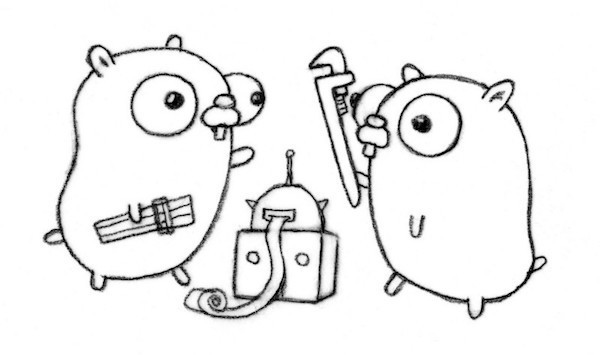

# Hook The Git
<p align="center">
  
</p>

## Why?
To increase the productivity of a developer, I would like to simplify the workflow when trying to develop an application. 

One way to do that are by using **git hooks**. Git hooks are scripts that Git executes before or after events such as: commit, push, and receive. Git hooks are a built-in feature - no need to download anything. Git hooks are run locally. 

In this repo, I present to you 4 types of hook that i like to use (pre-commit, commit-msg, pre-push and post-checkout). You could see more details on each hooks [here](https://githooks.com/). 

## Hooks Overview
In this repo, there are 4 hooks that I implemented for Golang (could be used for other programming languange too):
- pre-commit: Used to apply gofmt & goimports before committing the code.
- commit-msg: Used to check the format of commit message before commit. Will fail if not suitable from predetermined template
- pre-push: Used to check with unit test before pushing items into remote repo. But, will pass if commit message contains WIP (work in progress). Also, prevent from accidental push to master.
- post-checkout: Used to perform dependencies check (vendor, etc) when switching branch.

## Prerequisites
- Golang minimum v1.12 (https://golang.org/doc/install)
- Go Modules (https://blog.golang.org/using-go-modules)

## How to Run 
1. Clone the repository
```bash
git clone git@github.com:William9923/hook-the-git.git
```
2. Setup the hooks
```bash
sh ./setup.sh
```
3. (Optional) Run the project
```bash
sh ./run-hookthegit.sh
```
4. (Optional) Run the test
```bash
sh ./runtest.sh
```

